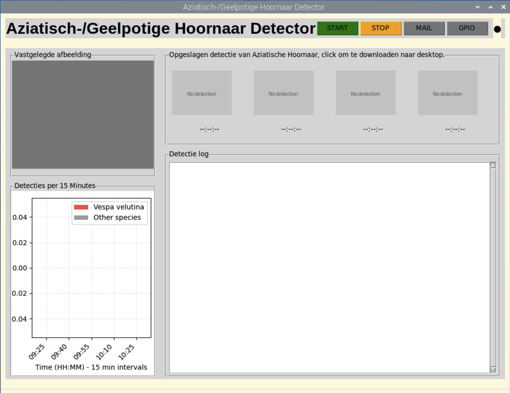
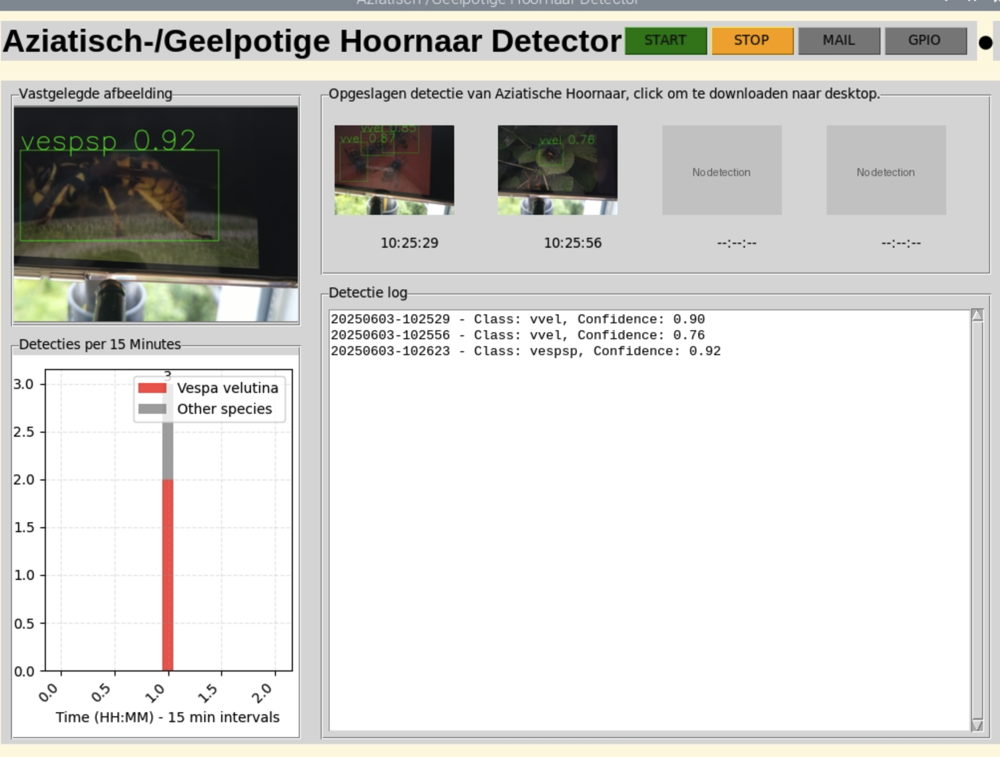

# vespCV - Asian Hornet Detection System

## Overview
The vespCV project aims to develop an automated detection system for the invasive Asian hornet (Vespa velutina). This system leverages computer vision technology to provide beekeepers and researchers with a reliable tool for monitoring and controlling hornet populations.

## Table of Contents
- [Introduction](#introduction)
- [Installation Instructions](#installation-instructions)
- [Usage Guide](#usage-guide)
- [Using Your Raspberry Pi Remotely](#using-your-raspberry-pi-remotely)
- [Advanced configuration](#advanced-configuration)
- [Troubleshooting](#troubleshooting)
- [License](#license)
- [Additional Resources](#additional-resources)

## Introduction
In recent years, the invasive Asian hornet (Vespa velutina) has posed a significant threat to honeybee populations and, consequently, to our ecosystems and agriculture. The `vespCV` project aims to develop an open-source non-profit automated detection system that empowers beekeepers, volunteers, and researchers to combat this growing challenge effectively.

### Problem Statement
The Asian hornet threatens honeybees and can possibly disrupt local ecosystems. Beekeepers, Asian hornet controlers, and researchers need a reliable, easy-to-use way to spot these hornets early.

### Solution Overview
`vespCV` uses a Raspberry Pi 4 and a camera to automatically spot Asian hornets. It takes pictures, checks them with a computer vision model (YOLOv11s), and alerts you if an Asian hornet is found.

## Installation Instructions

### Hardware Requirements
- [**Raspberry Pi4 B**](https://www.raspberrypi.com/products/raspberry-pi-4-model-b/?variant=raspberry-pi-4-model-b-8gb) (An 8GB and 4GB versions were used for this project) or a [**Raspberry Pi5**](https://www.raspberrypi.com/products/raspberry-pi-5/) (8GB)
- **Power Supply**: Ensure you have a suitable power supply for the Raspberry Pi. For edge detection in the field you can use a Raspberry Pi 4 with a 5V 3A powerbank. (The Raspberry Pi5 needs 5V 5A.)
- **Micro SD Card**: A 32GB card was used for this project.
- **Micro SD Card Reader**: Needed to flash the OS onto the micro SD card.
- **Camera**: 
  - **Raspberry Camera Module 3** or 
  - **Arducam IMX519 16MP Autofocus Camera Module** (a Camera module 2 will probably also work).
- **Camera Mount and Protector** (optional): To secure the camera in place.
- [**Bait lure**](https://www.rbka.org.uk/index.php/asian-hornet/traps-and-lures) : To attract hornets.

### Installing Raspberry Pi OS
1. Install Raspberry Pi OS Bookworm.
   - Use Raspberry Pi Imager to install Bookworm (64-bit) on your SD card. Select:
     - **Raspberry Pi Model**: Raspberry Pi 4 or Raspberry Pi 5
     - **Operating System**: Raspberry Pi OS (64-bit)
     - **Edit settings to preconfigure**:
       - **hostname**: pi
       - **username**: vcv
       - **password**: `choose-a-save-password`
       - Configure other options according to your Wi-Fi and time zone settings.
   - Detailed information can be found [here](https://www.raspberrypi.com/documentation/computers/getting-started.html).
   - Connect a keyboard and monitor to the Raspberry Pi, or alternatively, use SSH or [Raspberry Pi Connect](https://www.raspberrypi.com/software/connect/) for remote access.

2. Clone the repository:
   ```bash
   sudo apt update
   sudo apt upgrade -y
   git clone https://github.com/vespCV/vespcv.git
   cd vespcv
   ```

3. Set up the virtual environment and install dependencies:
   ```bash
   python3 -m venv venv
   source venv/bin/activate
   pip install -r requirements.txt
   ```

4. Create a launch script named `start_vespcv`:
   ```bash
   nano /home/vcv/start_vespcv
   ```
   Copy and paste these lines into the file:
   ```bash
   #!/bin/bash

   # Change to the vespCV directory
   cd /home/vcv/vespcv

   # Activate the virtual environment
   source venv/bin/activate

   # Set display for GUI
   export DISPLAY=:0

   # Add the project root to PYTHONPATH
   export PYTHONPATH=/home/vcv/vespcv:$PYTHONPATH

   # Start the application using the virtual environment's Python
   /home/vcv/vespcv/venv/bin/python src/core/main.py
   ```
   Save the file by pressing:
   - `Ctrl + X`
   - Press `Y` to confirm
   - Press `Enter` to save

5. Make the script executable:
   ```bash
   chmod +x /home/vcv/start_vespcv
   ```

6. **Email Configuration (Optional)**:
   If you don't want email alerts, or if the Raspberry Pi has no connection to Wi-Fi when detecting, you can skip this step. To receive email notifications when an Asian hornet is detected, follow these steps:
   - **Create a Gmail Account**: Create an account for your hornet detector. You can use an existing email or create a new one for safety and to avoid spam.
   - **Enable Two-Factor Authentication (2FA)**: Activate 2FA for your Gmail account to enhance security.
   - **Generate an App Password**: Create an [app password](https://support.google.com/mail/answer/185833?hl=en#:~:text=in%20or%20out-,Sign%20in%20with%20app%20passwords,-Sign%20in%20with) for your account. This password will be used instead of your regular email password.
   - **Configure Email Credentials**: To receive email notifications when an Asian hornet is detected, you need to set up your email credentials. Follow these steps:
     - **Create a new file** in your home directory to store your email credentials:
        ```bash
        nano ~/.vespcv_credentials
        ```
     - **Add your email address and app password** to the file. Replace `your_email@gmail.com` and `your_app_password` with your actual email and the app password you generated:
        ```bash
        export EMAIL_USER="your_email@gmail.com"
        export EMAIL_PASS="your_app_password"
        ```
     - **Save the file** by pressing:
        - `Ctrl + X` to exit
        - Press `Y` to confirm changes
        - Press `Enter` to save
    - **Set File Permissions**:
      - To ensure that only you can read this file, set its permissions with the following command:
      ```bash
      chmod 600 ~/.vespcv_credentials
      ```
    - This command restricts access so that only the file owner can read and write it.

**Important**: Always store your email credentials securely. Avoid pushing this file to version control to protect your sensitive information. It's advisable to create a separate Gmail account specifically for the vespCV detector to enhance security and privacy.

7. Make the script executable:
   ```bash
   chmod +x /home/vcv/start_vespcv
   ```

     ### Important Notes:
    - Ensure that you store your email credentials securely. Avoid pushing `.bashrc` or any files containing sensitive data to version control.
    - An email notification is sent automatically when the first Vespa velutina is detected.

8. Set up autostart with GUI:
   ```bash
   # Open the crontab editor
   crontab -e
   ```
   Add this line to start the application at boot:
   ```bash
   @reboot sleep 30 && /home/vcv/start_vespcv >> /home/vcv/vespcv/data/logs/startup.log 2>&1
   ```
   The `sleep 30` ensures the system is fully booted before starting the application.

## Usage Guide

For the setup of the Raspberry Pi and camera module 3 check the official [documentation](https://www.raspberrypi.com/documentation/accessories/camera.html).

### Starting the Application
1. Open a terminal window
2. Type `./start_vespcv` and press Enter
3. The application window will open automatically



### Understanding the Interface

The application interface consists of the following sections:

1. **Top Bar**
   - **`START`** (Green button): Starts the hornet detection
   - **`STOP`** (Orange button): Pauses the detection
   - **`MAIL`** (Gray/Blue button): Toggles email alert for Asian hornet detection
   - **`GPIO`** (Gray/Red button): Controls external hardware like a trap or deterrent device (e.g., electric harp – placeholder functionality).
   - **LED Indicator** (●): Shows the current status of the detection system

2. **Main Screen**
   - **Left Panel**:
     - Shows the latest captured image with detection results
     - Detection chart displaying Asian hornet activity (red bars) and other insects (gray bars) over time
   - **Right Panel**:
     - Recent detections (click any image to save it to your desktop)
     - Detection log showing detections and system activity

### Using the System

1. **Starting Detection**
   - Detection starts automatically when the application launches
   - The captured image will appear on the left side
   - The system will automatically scan for hornets

2. **Email Alerts**
   - Click the **MAIL** button to enable email notifications. When activated, you will receive an email with both the unannotated and annotated images upon the first detection of an Asian hornet.
   - When enabled, you'll receive an email when the first Asian hornet is detected (requires internet connection and email configuration)
   - The MAIL button turns blue when email alerts are active

3. **Saving Detections**
   - When a hornet is detected, the image appears in the "Recent Detections" panel
   - Click any detection image to save it to your desktop (requires internet connection)
   - Images are automatically saved with date and time information in the `vespcv/data/images` folder

4. **Stopping the System**
   - Click the orange **STOP** button to pause detection
   - To close the application, click the X in the top-right corner

5. **Continuing Detection**
   - Click the green **START** button to resume detection after stopping

6. **Test the system**
   - For testing purposes, you can use the [insect slider](test/InsectSlider.m4v) to simulate different insect detections. Play the video on your computer monitor or smartphone in front of the camera as a mockup for real insects. This setup allows you to evaluate the system's response to various scenarios and ensures accurate hornet detection.

### Tips for Best Results
- Ensure the camera has a clear view of the area you want to monitor
- Keep the camera lens clean and free from obstructions
- Position the camera in a well-lit area for better detection



## Using Your Raspberry Pi Remotely

You can control and view your Raspberry Pi from another computer, tablet, or phone using **Raspberry Pi Connect**. This makes it easy to set up and monitor your hornet detector, even if you're not near the device. However, this feature only works if the Raspberry Pi has access to a Wi-Fi network.

- **Raspberry Pi Connect**:  
  [Official Guide: How to use Raspberry Pi Connect](https://www.raspberrypi.com/documentation/computers/remote-access.html#raspberry-pi-connect)

If you've never used a Raspberry Pi before, check out these beginner-friendly guides:

- [Getting Started with Raspberry Pi](https://www.raspberrypi.com/documentation/computers/getting-started.html)
- [How to Set Up Your Raspberry Pi](https://projects.raspberrypi.org/en/projects/raspberry-pi-setting-up)
- [How to Connect a Camera to Raspberry Pi](https://www.raspberrypi.com/documentation/accessories/camera.html)

## Advanced Configuration

The system can be customized through the `config.yaml` file. Here are the main settings you can adjust:

### Detection Settings
- **Confidence Threshold** (default: 0.70)
  - Higher values (closer to 1.0) mean more certain detections
  - Lower values might catch more hornets but could include false positives
  - Recommended range: 0.60 - 0.80

### Camera Settings
- **Lens Position** (default: 1)
  - 0: Far distance (approximately 3 meters)
  - 1: Medium distance (approximately 1 meter)
  - 10: Close-up (approximately 10 centimeters)
  - To test lens position: `libcamera-still -t 0 --autofocus-mode continuous --info-text "%lp"`

### Timing Settings
- **Capture Interval** (default: 15 seconds)
  - How often the camera takes a new picture
  - Lower values mean more frequent checks but higher resource usage
  - Recommended range: 10-30 seconds

- **Chart Interval** (default: 15 minutes)
  - How detections are grouped in the activity chart
  - Affects how the detection history is displayed
  - Recommended range: 10-30 minutes

### LED Settings
- **LED Pin** (default: 21)
  - GPIO pin number for the status LED
  - Only change if you've connected the LED to a different pin

- **LED Duration** (default: 3 seconds)
  - How long the LED stays on after a detection
  - Adjust based on your visibility needs

### Troubleshooting

If you encounter any issues, follow these steps:

1. **General Checks**:
   - Check that the camera is properly connected.
   - Ensure the system has a stable internet connection for email alerts.
   - If you have problems, check the log files in the `data/logs/` folder for more details.

### Camera Issues
- **Camera not detected**: 
  - Ensure the camera is properly connected.
  - Run `sudo raspi-config` and enable the camera interface.
  - Reboot the Raspberry Pi.

- **Camera permission errors**:
  - Add your user to the video group:
    ```bash
    sudo usermod -a -G video $USER
    ```
  - Log out and log back in for changes to take effect.

### Model Detection Issues
- **Low detection accuracy**:
  - Check if the camera is properly focused.
  - Ensure adequate lighting.
  - Adjust confidence thresholds in the code if needed.

- **Model loading errors**:
  - Verify the model file (`best.pt`) is in the correct directory.
  - Check if the model file is not corrupted.
  - Ensure sufficient RAM is available (at least 4GB recommended).

### Network Issues
- **SSH connection problems**:
  - Verify the Raspberry Pi is on the same network.
  - Check if SSH is enabled:
    ```bash
    sudo systemctl status ssh
    ```
  - Verify the IP address hasn't changed.

### GPIO Issues
- **GPIO Test Script for Connected Hardware**:
  - The script uses the `config.yaml` file to determine which GPIO pin to test. Ensure you have connected to pin 21 and ground, or change the default pin 21 to the pin you have connected in the `config.yaml`.
  - To use the `GPIO_test.py` file for testing the GPIO functionality on your Raspberry Pi, run the following command:
    ```bash
    export PYTHONPATH=$PYTHONPATH:/home/vcv/vespcv/src
    python test/GPIO_test.py
    ```

## License
This project is licensed under the GPL Version 3. See the [LICENSE](LICENSE) file for details.

## Additional Resources
- [Raspberry Pi Documentation](https://www.raspberrypi.org/documentation/): Official documentation for Raspberry Pi.
- [YOLOv11 Documentation](https://docs.ultralytics.com/): Documentation for the YOLOv11 model.
- [OpenCV Documentation](https://docs.opencv.org/): Documentation for OpenCV, the library used for image processing.
- [Python Documentation](https://docs.python.org/3/): Official Python documentation for reference on Python programming.
- [waarnemingen.nl](https://waarneming.nl/): An official platform for reporting sightings of Asian hornets, allowing users to submit images and additional information to aid in monitoring and controlling hornet populations.
- [Arducam documentation](https://docs.arducam.com/Raspberry-Pi-Camera/Pivariety-Camera/Quick-Start-Guide/): This guide provides detailed instructions on setting up and using the Arducam camera with the Raspberry Pi, including installation steps, configuration options, and troubleshooting tips.
- [Raspberry Camera Module 3 documentation](https://www.raspberrypi.com/documentation/accessories/camera.html): This official documentation covers the features, setup, and usage of the Raspberry Camera Module 3.


